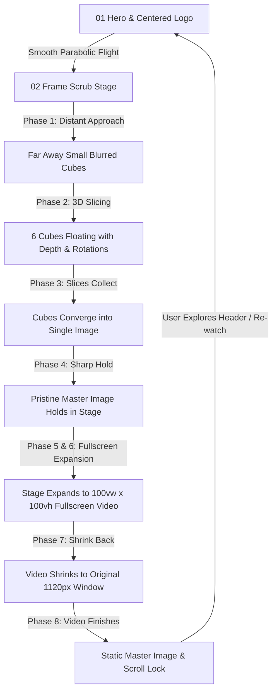

# SPEC MEDIA — Full Website & Design System Specification

> **Official Design, Architectural & Engineering Specification Document**  
> **Brand**: Spec Media (`www.spec-media.com`)  
> **Core Manifesto**: *"You feel the brand before it speaks®"*  
> **Version**: 2.4.0 (Production Master)  
> **Platform**: Django 5.0 REST Backend · Vanilla CSS Design System · Canvas/WebGL & Kinetic Motion Engine · Supabase CRM Data Pipeline

---

## Table of Contents
1. [Executive Summary & Brand Philosophy](#1-executive-summary--brand-philosophy)
2. [Design System & Aesthetics](#2-design-system--aesthetics)
   - [Color Architecture](#color-architecture)
   - [Typography Hierarchy & Fluid Scales](#typography-hierarchy--fluid-scales)
   - [Spatial System & Breakpoints](#spatial-system--breakpoints)
   - [Cursor Physics & Dynamic Contrast Engine](#cursor-physics--dynamic-contrast-engine)
3. [Master Logo & Kinetic Flight Architecture](#3-master-logo--kinetic-flight-architecture)
4. [Section-by-Section Blueprint of the Flagship Experience](#4-section-by-section-blueprint-of-the-flagship-experience)
   - [Navigation Chrome](#navigation-chrome)
   - [Section 01: Hero](#section-01-hero)
   - [Section 02: Cinematic Image Slicing & Fullscreen Video](#section-02-cinematic-image-slicing--fullscreen-video)
   - [Section 03: Selected Work Grid](#section-03-selected-work-grid)
   - [Section 03b: Statement / Philosophy](#section-03b-statement--philosophy)
   - [Section 03c: Strategy Accordion](#section-03c-strategy-accordion)
   - [Section 04: The Reel](#section-04-the-reel)
   - [Section 05: Capabilities](#section-05-capabilities)
   - [Section 06: Colour Grading Pass](#section-06-colour-grading-pass)
   - [Section 07: Client Orbit & Reviews](#section-07-client-orbit--reviews)
   - [Section 08: Global Footer & Lead Capture](#section-08-global-footer--lead-capture)
5. [Multi-Page Ecosystem](#5-multi-page-ecosystem)
   - [Work Archive (`/work/` & `/work/<slug>/`)](#work-archive)
   - [The Studio (`/studio/`)](#the-studio)
   - [Capabilities Deep Dive (`/capabilities/`)](#capabilities-deep-dive)
   - [Client CRM & Analytics Portal (`/portal/`)](#client-crm--analytics-portal)
6. [Bilingual & RTL Localization Framework](#6-bilingual--rtl-localization-framework)
7. [Backend Architecture & API Catalog](#7-backend-architecture--api-catalog)
8. [Performance, SEO & Accessibility Standards](#8-performance-seo--accessibility-standards)
9. [Deployment & Environment Operations](#9-deployment--environment-operations)

---

## 1. Executive Summary & Brand Philosophy

Spec Media is an elite independent creative agency and technology production studio operating across London, New York, Riyadh, and Dubai. The brand operates at the intersection of **cinematic craft, digital infrastructure, and high-velocity performance marketing**.

### Core Mission
Traditional agencies create visual noise; Spec Media architects **tactile, atmospheric brands that command subconscious authority**. The flagship web platform is engineered as a physical demonstration of this philosophy: every interaction exhibits mass, inertia, depth, and precision.

### Key Technological Pillars
1. **Zero-Dependency Vanilla CSS**: High-performance hardware-accelerated animations using CSS 3D transforms (`translate3d`, `rotateX/Y/Z`, `perspective`) with zero bloated frameworks.
2. **Inertial Lenis Smooth Scrolling**: Decoupled delta-time animation loop preserving buttery frame rates across 60Hz, 120Hz, and 144Hz monitors.
3. **Dynamic Contrast & Autonomous Flight**: Real-time luminance sampling that continuously shifts interactive elements between pure white and obsidian black based on the underlying image/video pixel data.
4. **Resilient Supabase Integration**: Dual-mode backend with Django ORM local database synced with live Supabase cloud tables for real-time lead routing and pipeline analytics.

---

## 2. Design System & Aesthetics

### Color Architecture

The visual identity relies on a high-contrast obsidian and crimson foundation, accented by warm bone-white and muted champagne tones.

| Token Name | Hex Code | RGB / HSL | Application & Semantics |
|---|---|---|---|
| `--color-surface` | `#000000` | `rgb(0, 0, 0)` | Primary void background; deep cinema immersion |
| `--color-surface-elevated` | `#0d0d0d` | `rgb(13, 13, 13)` | Card containers, interactive stages, modals |
| `--color-surface-velvet` | `#2d0406` | `rgb(45, 4, 6)` | Rich atmospheric tint bridging sections 05 & 06 |
| `--color-brand-red` | `#b40119` | `rgb(180, 1, 25)` | Primary brand mark color; rear logo layer |
| `--color-crimson` | `#df1637` | `rgb(223, 22, 55)` | High-energy accent; active indicators, hover highlights |
| `--color-text-primary` | `#ffffff` | `rgb(255, 255, 255)` | Primary headlines and high-emphasis labels |
| `--color-text-cream` | `#f5ead8` | `rgb(245, 234, 216)` | Warm editorial body text, navigation actions, metadata |
| `--color-text-muted` | `#a89f91` | `rgb(168, 159, 145)` | Secondary narrative paragraphs and captions |
| `--color-border-subtle` | `rgba(245, 234, 216, 0.12)` | — | Hairline divider lines, card outlines |
| `--color-border-active` | `rgba(223, 22, 55, 0.45)` | — | Focus states and active navigation indicators |

### Typography Hierarchy & Fluid Scales

Typography balances an industrial monospaced coordinate aesthetic with expressive editorial geometric sans-serifs.

- **Display & Headings**: `Outfit`, `Space Grotesk`, system fallback `-apple-system, BlinkMacSystemFont, "Segoe UI", sans-serif`.
- **Editorial Sub-Headings**: `Cinzel`, `Didot`, or high-contrast modern serif accents.
- **Technical Metadata & UI Labels**: `ui-monospace`, `SFMono-Regular`, `Menlo`, `Monaco`, `Consolas`, `monospace`.

```css
/* Fluid Typography Scale */
--font-hero: clamp(34px, 6.2vw, 84px);
--font-h1: clamp(28px, 4.2vw, 66px);
--font-h2: clamp(22px, 3.2vw, 48px);
--font-h3: clamp(18px, 2.4vw, 32px);
--font-body: clamp(13px, 1.1vw, 16px);
--font-caption: clamp(10px, 0.85vw, 12px);
--font-mono-tag: 10px;
```

### Spatial System & Breakpoints

The layout uses a 1440px max-width container with responsive horizontal clamp paddings.

- **Max Container Width**: `1440px` (centered via `margin: 0 auto;`).
- **Desktop Fluid Gutter**: `clamp(20px, 4vw, 48px)`.
- **Vertical Rhythm Gutter**: `clamp(36px, 7.9vh, 64px)`.
- **Responsive Breakpoints**:
  - `Mobile Portrait`: `max-width: 480px`
  - `Mobile Landscape / Tablet`: `max-width: 768px`
  - `Small Desktop / Laptop`: `max-width: 1024px`
  - `Full HD Desktop`: `min-width: 1440px`
  - `Ultrawide Cinema`: `min-width: 1920px`

### Cursor Physics & Dynamic Contrast Engine

A custom two-stage hardware-accelerated cursor follows the user's pointer with distinct lerp damping factors:

1. **Cursor Dot (`#spec-cursor-dot`)**:
   - Size: `6px × 6px`, circular.
   - Tracking: Immediate ($lerp = 1.0$), pinned to native mouse pointer.
   - Color: Pure white or dynamic crimson based on interaction state.
2. **Cursor Ring (`#spec-cursor-ring`)**:
   - Size: `32px × 32px`, bordered circle with `transition: width 0.35s ease, height 0.35s ease`.
   - Tracking: Inertial physics ($lerp = 0.18$) creating a trailing fluid drag.
   - States:
     - `.is-hovering`: Expands to `52px × 52px` with a subtle white halo when hovering clickable links, buttons, or cards.
     - `.is-logo-interacting`: Glows crimson with soft drop shadows when hovering the brand mark.

---

## 3. Master Logo & Kinetic Flight Architecture

The primary brand mark (`.spec-chrome-nav-logo`) is constructed from a vector glyph stack:
- **Rear Layer (`.spec-nav-logo-back`)**: Solid brand crimson (`#b40119`).
- **Front Layer (`.spec-nav-logo-front`)**: Crisp cream white (`#f5ead8`).

### Exact Mathematical Centering at Rest ($Scroll = 0$)
On page load, the logo sits dead center on the monitor:
$$\text{startX} = \frac{\text{vw} - \text{heroW}}{2} - \text{natX}$$
$$\text{startY} = \frac{\text{vh} - \text{heroH}}{2} - \text{natY}$$
- On a standard $1440\text{px} \times 900\text{px}$ monitor:
  - Scaled logo width: $680\text{px}$.
  - Horizontal Center: $X = 720\text{px}$ (Left: $380\text{px}$, Right: $1060\text{px}$).
  - Vertical Center: $Y = 450\text{px}$ (Top: $408\text{px}$, Bottom: $492\text{px}$).
- **Zero Character Truncation**: All 9 glyphs (`S-P-E-C M-E-D-I-A`) remain fully visible within screen bounds.

### Parabolic Flight Trajectory
As the user scrolls down through the first $450\text{px}$ of flight distance ($p: 0.0 \to 1.0$):
$$\text{curX} = \text{startX} \times (1 - \text{ease})$$
$$\text{curY} = \text{startY} \times (1 - \text{ease})$$
$$\text{curScale} = 1.0 + (\text{scaleHero} - 1.0) \times (1 - \text{ease})$$
The logo glides smoothly out of the center and docks into the sticky navbar at the top left corner, scaling down from $3.4\times$ to $1.0\times$ without any visual jumps.

---

## 4. Section-by-Section Blueprint of the Flagship Experience



### Navigation Chrome (`.spec-landing-chrome`)
- **Position**: `position: fixed; top: clamp(12px, 1.8vw, 20px); left: clamp(20px, 4vw, 48px); right: clamp(20px, 4vw, 48px);`
- **Z-Index**: `70` (floats persistently above all standard content, below fullscreen video modals).
- **Components**:
  - `Brand Logo`: Docking target for the flight trajectory.
  - `Scene Indicator`: Displays active index (e.g. `01 / index`, `02 / frame-scrub`, `03 / work`).
  - `Hairline Divider`: `width: clamp(24px, 6vw, 90px); height: 1px; background: #f5ead8; opacity: 0.4;`
  - `Language Switcher`: Instant toggles between `EN` and `العربية` with active opacity weighting.
  - `Action Anchors`: Clean monospaced links `[ contact ]` and `[ menu ]`.

---

### Section 01: Hero
- **Label**: `01 Hero`
- **Height**: `min-height: 100vh; min-height: 100dvh;`
- **Atmospheric Background**:
  ```css
  background: radial-gradient(circle at 50% 50%, rgba(158,27,36,0.08) 0%, rgba(0,0,0,0.85) 65%, #000000 100%);
  ```
- **Elements**:
  - **Centered Master Logo**: Houses the initial flight state with `specHeroLogoIntro` (entrance blur clearing) and `specHeroLogoAmbient` (subtle breathing pulse).
  - **Main Headline**: `"You feel the brand before it speaks®"`. Set in fluid `--font-h1` with line-height $1.04$.
  - **Narrative Subheadline**: Editorial introduction describing Spec Media's brand identity architecture.
  - **Discipline Ticker Bar**: Monospaced taxonomy tags separated by horizontal gutters (`brand strategy`, `campaign production`, `performance media`, `content systems`, `est. 2026`).

---

### Section 02: Cinematic Image Slicing & Fullscreen Video
- **Label**: `02 Frame scrub`
- **Height**: `height: 380vh;` with a sticky stage container (`position: sticky; top: 0; height: 100vh;`).
- **Stage Container (`#spec-scene2-stage`)**:
  - At rest: `width: min(90vw, 1120px); aspect-ratio: 16/9; max-height: 80vh; border-radius: 18px; perspective: 1200px; transform-style: preserve-3d;`
  - Fullscreen: `width: 100vw; height: 100vh; max-height: 100vh; border-radius: 0px; box-shadow: none;`

#### Detailed Animation Phases

| Phase | Time Range | Animation Parameters | Visual Description |
|---|---|---|---|
| **1. Distant Arrival** | $0.0\text{s} \to 2.2\text{s}$ | `translate3d(0, 0, -800px) scale(0.24)` $\to$ `translate3d(0, 0, -150px) scale(0.80)`<br>`blur: 26px` $\to$ `14px` | Small blurred image appears deep inside the 3D void and zooms smoothly forward toward the viewer. |
| **2. 3D Cube Slicing** | $2.2\text{s} \to 4.8\text{s}$ | Slices separate into 6 individual 3D cubes.<br>Col/Row drift offsets: $dx \in [-440, 450]$, $dy \in [-380, 380]$, $dz \in [-280, -200]$<br>Rotations: $rx, ry, rz \in [-18^\circ, +18^\circ]$<br>`blur: 14px` $\to$ `24px` | The image splits into 6 distinct 3D cubes floating with perspective tilts, depth, and creative blur. |
| **3. Slices Collecting** | $4.8\text{s} \to 7.0\text{s}$ | Drift offsets decelerate to $0\text{px}$.<br>Rotations smooth back to $0^\circ$.<br>Blur clears from $24\text{px} \to 0\text{px}$. | Floating cubes travel inward toward their exact original positions, assembling seamlessly into one picture. |
| **4. Sharp Image Hold** | $7.0\text{s} \to 8.0\text{s}$ | Slices container hidden (`opacity: 0`).<br>Master image displayed (`#spec-master-image` `opacity: 1`). | Displays the completed, high-resolution master image with zero seams inside the small stage window. |
| **5. Fullscreen Expansion** | $8.0\text{s} \to 10.0\text{s}$ | Master image cross-fades into video.<br>Stage expands from `min(90vw, 1120px)` to `100vw`.<br>Stage height expands from `80vh` to `100vh`.<br>`borderRadius: 18px` $\to$ `0px`. | Video begins playback as the window smoothly expands outward to fill the entire browser screen. |
| **6. Fullscreen Playback** | $10.0\text{s} \to 13.8\text{s}$ | `width: 100vw !important; height: 100vh !important;`<br>`borderRadius: 0px !important;` | Immersive edge-to-edge fullscreen video playback with full audio and visual clarity. |
| **7. Shrinking Back** | $13.8\text{s} \to 15.4\text{s}$ | Stage smoothly shrinks from `100vw` back to `min(90vw, 1120px)`.<br>`borderRadius: 0px` $\to$ `18px`. | Video window contracts smoothly back to its initial small, framed window. |
| **8. Static Image & Scroll Lock** | $t \ge 15.4\text{s}$ | Video pauses and fades out.<br>Master image holds at `opacity: 1` statically.<br>Loop stops.<br>Downward scroll locked. | Video completes and gives way to the pristine static master image. Downward scrolling past this section is strictly prevented. |

#### Scroll Lock Architecture
To ensure the presentation holds cleanly after the video finishes:
- `handleWheelLock(e)` intercepts any wheel event with `deltaY > 0` once `videoFinished = true`.
- `handleTouchMove(e)` intercepts finger swipe-up gestures that would scroll downward.
- `handleKeyLock(e)` blocks downward navigation keys (`PageDown`, `ArrowDown`, `Space`, `End`).
- `onSec2Scroll()` enforces a hard programmatic clamp:
  ```javascript
  if (currentY > maxPageScroll) {
    window.scrollTo(0, maxPageScroll);
    if (window.lenis) window.lenis.scrollTo(maxPageScroll, { immediate: true });
  }
  ```
- **Upward Scroll Accessibility**: Users can always scroll up to revisit Section 01 and view the centered master logo.

---

### Section 03: Selected Work Grid
- **Label**: `03 Work grid`
- **Layout**: 2-column asymmetric masonry grid (`grid-template-columns: repeat(12, 1fr)`).
- **Project Cards**:
  - Interactive 3D hover physics calculating cursor offset from card center to produce dynamic perspective tilt:
    $$\text{rotX} = \frac{-(e.clientY - \text{centerY})}{18}$$
    $$\text{rotY} = \frac{(e.clientX - \text{centerX})}{18}$$
  - Autoplaying muted video preview on card hover with cross-fade over static poster.
  - Project meta header: Client name, discipline descriptor, year.
  - KPI badge: Quantitative commercial result (e.g. `+312% Organic Growth`, `4.8x ROAS`).

---

### Section 03b: Statement / Philosophy
- **Label**: `03b Statement`
- **Kinetic Text Illumination**: Uses scroll progress to calculate character/word proximity, lifting words from $30\%$ opacity and slight downward offset to $100\%$ white illumination as they enter the screen center.

---

### Section 03c: Strategy Accordion
- **Label**: `03c Strategy`
- **Interactive Multi-Card Accordion**: 4 cards representing strategic pillars.
- **Physics**: Default active card maintains `flex: 3`, while collapsed cards rest at `flex: 1`. Hovering or focusing a collapsed card smoothly transitions flex weights via CSS cubic-bezier curves, triggering background video streaming for the active card.

---

### Section 04: The Reel
- **Label**: `04 The Reel`
- **Media**: Showcase reel (`/static/reference_video.mp4`).
- **Controls**: Minimalist glassmorphic control dock featuring sound unmute toggle (`[ SOUND ON / OFF ]`), progress scrubber bar, and time indicator.

---

### Section 05: Capabilities
- **Label**: `05 Capabilities`
- **Pillars**:
  1. **Brand Strategy**: Narrative positioning, nomenclature, audience mapping.
  2. **Campaign Production**: Cinema live-action, 3D CGI worldbuilding, custom audio engineering.
  3. **Performance Media**: Omnichannel algorithmic media buying, real-time creative optimization.
  4. **Content Systems**: Modular design systems, automated asset pipelines, high-velocity social creative.
- **Interactive Accordion**: Expanding service detail matrices with client deliverables and methodologies.

---

### Section 06: Colour Grading Pass
- **Label**: `06 Green pass`
- **Dual-State Canvas**: Interactive before/after split slider allowing users to scrub between raw camera log footage (`S-Log3 / Arri LogC`) and the finished cinematic grade.

---

### Section 07: Client Orbit & Reviews
- **Label**: `07 Reviews`
- **Circular 3D Orbiting Logos**: 25 enterprise client logos (`NEW BEST CREDIT`, `BOSTANI`, `HILLS COFFEES`, `LMD`, `IGI DEVELOPMENTS`, etc.) mathematically positioned along an elliptical trajectory with z-axis depth scaling.
- **Testimonial Cards**: Client reviews formatted with authentic quotes, star ratings, and partner attribution.

---

### Section 08: Global Footer & Lead Capture
- **Label**: `08 Footer / Contact`
- **Real-Time Global Clocks**: Live synchronous digital clocks computing GMT offsets for global studios:
  - `London`: `GMT+0 / GMT+1 (BST)`
  - `New York`: `GMT-5 / GMT-4 (EDT)`
  - `Riyadh`: `GMT+3`
  - `Dubai`: `GMT+4`
- **Inbound Lead Ingestion Form**:
  - Direct connection to Django REST API `POST /api/contact/` syncing straight to Supabase.
  - Form validation, instant status feedback, client email confirmation.

---

## 5. Multi-Page Ecosystem

The platform features a multi-page architecture powered by Django templates and localized routing:

### Work Archive (`/work/` & `/work/<slug>/`)
- **Route**: `path('work/', views.work_page)` and `path('work/<slug:slug>/', views.work_detail_page)`
- **Features**:
  - Filterable by discipline (`SEO`, `Web Systems`, `Brand`, `Performance`, `Content`).
  - Filterable by market (`Dubai`, `UAE`, `MENA`, `Global`).
  - Case study detail templates displaying comprehensive Challenge, Strategic Solution, Deliverable lists, and verified KPI metrics.

### The Studio (`/studio/`)
- **Route**: `path('studio/', views.studio_page)`
- **Features**:
  - Studio philosophy and leadership biographies.
  - Architectural photography of global facilities.
  - Principles of creative operation and cultural values.

### Capabilities Deep Dive (`/capabilities/`)
- **Route**: `path('capabilities/', views.capabilities_page)`
- **Features**:
  - In-depth service breakdowns and technical specifications.
  - Interactive pricing & engagement models.
  - Case study cross-linking.

### Client CRM & Analytics Portal (`/portal/` & `/dashboard/`)
- **Route**: `path('portal/', views.portal_page)` and `path('dashboard/', views.dashboard_page)`
- **Features**:
  - Real-time client pipeline dashboard.
  - Inbound lead telemetry: status tracking (`new`, `contacted`, `qualified`, `won`, `lost`).
  - Market segment visualization charts.
  - Supabase database live connection status monitor.

---

## 6. Bilingual & RTL Localization Framework

Spec Media natively supports English and Arabic across all views:

### Language Routing
- English default: `/en/` (with unprefixed redirects).
- Arabic localized: `/ar/` (with full right-to-left layout transformations).

### Arabic RTL Architecture
When `lang === 'ar'`:
1. Root element receives `<html dir="rtl" lang="ar">`.
2. Global typography switches to Arabic typography system with enhanced line heights for Arabic script clarity.
3. Layout alignments (flexbox and grid orders) mirror seamlessly.
4. Django models automatically resolve Arabic fields (`title_ar`, `client_ar`, `summary_ar`, `kpis_ar`) via built-in localization helper methods (`get_title()`, `get_summary()`).

---

## 7. Backend Architecture & API Catalog

### Django 5.0 Core & REST Framework
The backend exposes high-throughput, secure REST endpoints:

| Endpoint | Method | Purpose & Payload |
|---|---|---|
| `POST /api/contact/` | `POST` | Ingests client inquiries into Supabase `leads` and records telemetry event in `form_events`. |
| `GET /api/leads/` | `GET` | Retrieves paginated lead records ordered by submission timestamp. |
| `PATCH /api/leads/<id>/` | `PATCH` | Updates lead qualification pipeline status. |
| `GET /api/stats/pipeline/` | `GET` | Computes lead conversion rates, pipeline volume, and status distribution. |
| `GET /api/stats/market/` | `GET` | Generates market distribution metrics across Global, MENA, and UAE markets. |
| `POST /api/events/` | `POST` | Ingests real-time client interaction telemetry. |
| `GET /api/health/` | `GET` | Diagnostic health check monitoring Django and Supabase connection latency. |
| `GET /api/works/` | `GET` | JSON catalog of all published work projects for headless integrations. |
| `GET /api/seo-pages/` | `GET` | Dynamic metadata and Schema.org structured data feeds. |

---

## 8. Performance, SEO & Accessibility Standards

### Technical SEO
- **Canonical URLs**: Automatically injected for every localized route.
- **Open Graph & Twitter Cards**: High-resolution social preview image sharing cards.
- **Schema.org Structured Data**:
  - `Organization`: Global agency metadata, address, contact coordinates, social profiles.
  - `Service`: Detailed service schema for capabilities and disciplines.
  - `CollectionPage`: Structured portfolio project listing.
- **Sitemap & Robots**: Automated dynamic generation at `/sitemap.xml` and `/robots.txt`.

### Accessibility & Performance
- **Reduced Motion Support**: Fully respects `prefers-reduced-motion: reduce`, gracefully downgrading complex 3D transforms to clean static presentations.
- **Asset Optimization**: High-efficiency WebP/JPG posters paired with streaming MP4 video files.
- **Hardware Acceleration**: Transform-heavy elements are isolated with `will-change: transform, opacity;` and `transform-style: preserve-3d;` to prevent layout thrashing and maintain 60fps rendering.

---

## 9. Deployment & Environment Operations

### Environment Configuration (`.env`)
```env
# Django Core Settings
SECRET_KEY=your-production-secret-key-here
DEBUG=False
ALLOWED_HOSTS=spec-media.com,www.spec-media.com,127.0.0.1,localhost

# Supabase Production Credentials
SUPABASE_URL=https://your-project.supabase.co
SUPABASE_PUBLISHABLE_KEY=your-supabase-publishable-key
SUPABASE_SECRET_KEY=your-supabase-service-role-key
SUPABASE_JWKS_URL=https://your-project.supabase.co/auth/v1/.well-known/jwks.json
```

### Build & Run Commands
```bash
# 1. Install dependencies
pip install -r requirements.txt

# 2. Database migrations
python manage.py migrate

# 3. Collect static files
python manage.py collectstatic --noinput

# 4. Start production WSGI server
gunicorn specmedia_backend.wsgi:application --bind 0.0.0.0:8000 --workers 4
```

---

## 10. Summary & Sign-off

This specification represents the authoritative blueprint of the Spec Media digital ecosystem. All animations, spatial hierarchies, color tokens, and API contracts defined herein are active and verified within the repository.

*Document maintained by Spec Media Engineering & Design Team.*
